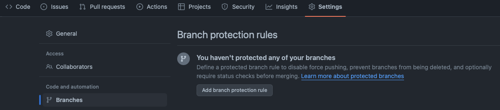

<div align="center">

[//]: # ( ==== Logo ================================================== ) 
<br>
<br>
<a href="https://norlab.ulaval.ca">
    <picture>
      <source media="(prefers-color-scheme: dark)" srcset="/visual/norlab_logo_acronym_light.png">
      <source media="(prefers-color-scheme: light)" srcset="/visual/norlab_logo_acronym_dark.png">
      
    </picture>
</a>
<br>
<br>

[//]: # ( ==== Title ================================================= )
# _NorLab Project Template_

[//]: # ( ==== Hyperlink and maintainer=============================== ) 
<sup>
    <a href="http://132.203.26.125:8111">NorLab TeamCity GUI</a>
    (VPN/intranet access) &nbsp; • &nbsp;
    <a href="https://hub.docker.com/repositories/norlabulaval">norlabulaval</a>
    (Docker Hub) &nbsp;
</sup>
<br>
<br>

[//]: # ( ==== Description =========================================== )
**A template repository for code-related research projects.
It’s meant to help kick-start repository creation by enabling software engineering 
research-oriented best practice.**
<br>
<br>
It has a few preconfigured tools such as an initialization script to speed up the repository 
customization process, a pull request template, a sematic-release github action, a standardized 
readme file with _NorLab_ or _VAUL_ logo, a git ignore file with common file/directory entries, a code owner 
designation file, JetBranins IDE run configurations and the basic directory structure. 

<br>

[//]: # ( ==== Badges ================================================ )
[](https://github.com/semantic-release/semantic-release)


[//]: # (NorLab teamcity)
[//]: # (<a href="http://132.203.26.125:8111"></a>)

[//]: # (Dockerhub image badge)
[//]: # (TODO: Change "norlabulaval/libpointmatcher" in both url to "your-dockerhub-domain/your-image-name")
[//]: # (<a href="https://hub.docker.com/repository/docker/norlabulaval/libpointmatcher/">  </a>)


<br>

[//]: # ( ==== Maintainer ============================================ )
<sub>
Maintainer <a href="https://redleader962.github.io">Luc Coupal</a>
</sub>

<br>
<hr style="color:lightgray;background-color:lightgray">
</div>


[//]: # ( ==== Body ================================================== ) 
**Note:** For `latex` project such as writing proposal or conference paper, use a template from the following list of [NorLab `TeX` template repositories](https://github.com/norlab-ulaval?q=template&type=all&language=tex&sort=) instead.  

# How to use this template repository

- [ ] [Step 1 › Generate the new repository](#step-1--generate-the-new-repository)
- [ ] [Step 2 › Execute `initialize_norlab_project_template.bash` (Support Ubuntu and Mac OsX)](#step-2--execute-initialize_norlab_project_templatebash)
- [ ] [Step 3 › Make it your own](#step-3--make-it-your-own)
- [ ] [Step 4 › Configure the _GitHub_ repository settings](#step-4--configure-the-github-repository-settings)
- [ ] [Step 5 › Release automation: enable semantic versioning tools](#step-5--enable-release-automation-tools-semantic-versioning)

# Instructions
## Step 1 › Generate the new repository
1. Click on the buttons `Use this template` > `Create a new repository` 
    <br>
   
2. find a meaningful repository name, don't worry you can change it latter (see BC Gov [Naming Repos](https://github.com/bcgov/BC-Policy-Framework-For-GitHub/blob/master/BC-Gov-Org-HowTo/Naming-Repos.md) recommendation for advice and best-practice)
3. Clone your new repository using the following command line
```shell
$ git clone --recurse-submodule https://github.com/<your-git-repository-url>
```

## Step 2 › Execute `initialize_norlab_project_template.bash`

(Support Ubuntu and Mac OsX)

It will execute the following steps:

1. Install resources (or skip):
    1. (optional) [Norlab Build System (NBS)](https://github.com/norlab-ulaval/norlab-build-system)
       submodule
    2. (optional) [NorLab Shell Script Tools (N2ST)](https://github.com/norlab-ulaval/norlab-shell-script-tools)
       submodule
    3. (optional) [_semantic-release_](https://semantic-release.gitbook.io) 
2. Customize 
   1. environment variable prefixes and shell functions project wide
   2. repository name references project wide
3. Manage readme files
   1. rename `README.md` to `NORLAB_PROJECT_TEMPLATE_INSTRUCTIONS.md`
   2. rename either `README.norlab_template.md` or `README.vaul_template.md` 
       to `README.md` and delete the other one
   3. customize url references 
4. Reset the content of `CHANGELOG.md`

## Step 3 › Make it your own

1. Configure the repository directory structure for your project type
2. Modify the code owner designation file: `.github/CODEOWNERS`
3. Validate the content of `.gitignore` file
4. Modify the pull request template to fit your workflow needs: `.github/pull_request_template.md`
5. Make your new `README.md` file your own

**Note:** `CHANGELOG.md` and `version.txt` are both automatically generated
by _semantic-release_

## Step 4 › Configure the _GitHub_ repository settings

★ The `main` branch is sacred. It must be deployable at any time.  
 We strongly recommend you to configure your repository branching scheme following [**_Gitflow_**](https://www.atlassian.com/git/tutorials/comparing-workflows/gitflow-workflow)
 
 ```bash
 main ← dev ← feature 1
            ↖ feature 2
 ```
 with _**Branch Protection Rule**_ enable for the default branch (i.e. `main`) and the `dev` branches.

Go to the `Settings` > `Branches` and click `Add branch protection rule` in the _Branch Protection Rule_ panel 



and set the following:
1. Set _Branch name pattern_ to `main`
2. Set _Require a pull request before merging_
3. Set _Require conversation resolution before merging_
4. Set _Restrict who can push to matching branches_ and add names
5. If you use a Continuous Integration service such as _**GitHub actions**_ or our **_norlab-teamcity-server_**, set _Require status checks to pass before merging_ and set _Require branches to be up to date before merging_
6. Repeat for the `dev` branch
   


## Step 5 › Enable release automation tools (semantic versioning)  

### Why:
Assuming your repository is part of a bigger system, 
- easily identify the repository state currently in use as a dependency
- and escape "dependency hell". 

### How
Any push to the `main` branch will trigger the execution of [_semantic-release_](https://semantic-release.gitbook.io) which will analyse each commits message to determine the version bump following [_semantic versioning_](https://semver.org) scheme `MAJOR.MINOR.PATCH`.

### On version bump, 
- a new repository tag gets published with the newest versions number `v<MAJOR>.<MINOR>.<PATCH>`
- the `CHANGELOG.md` and the `version.txt` files gets updated
- a new repository release gets published on the _Releases_ page 

**Note:** not each commit type triggers a version bump e.g.
`<type>!` triggers a `MAJOR` version bump, 
`feat` triggers a `MINOR` version bump, 
`fix` and`perf` triggers a `PATCH` version bump
and all others such as `doc` and `style` will register for the next release but won't trigger one.


### Configuration
1. Adopt the [_conventional-commit_](https://www.conventionalcommits.org/) specification. This is a **hard requirement** for _semantic-release_.  
  See [commit_msg_reference.md](./commit_msg_reference.md) for a quick summary.
2. Configure the _**semantic-release**_ GitHub action implemented in the `.github/workflows/` directory. 
   1. You must generate a GitHub [personal access token](https://help.github.com/en/github/authenticating-to-github/creating-a-personal-access-token-for-the-command-line) 
   2. and register it as a _Repository Secrets_ in the tab `Settings/secrets and variables/Actions` and name it `SEMANTIC_RELEASE_GH_TOKEN`.  
     Reference: [semantic-release/GitHub Actions](https://semantic-release.gitbook.io/semantic-release/recipes/ci-configurations/github-actions)  


---

# Questions: 

**I'm concern using _conventional-commit_ will slow me down:** 
<br> 
It does not discourage moving fast, ["It discourages moving fast in a disorganized way"](https://www.conventionalcommits.org/en/v1.0.0/#doesnt-this-discourage-rapid-development-and-fast-iteration) 

**What if I want to revert a buggy release:**
<br> 
Either fix the bug and push a `fix` commit or revert the problematic commits and push a `revert` commit.  

**I don't want to use _semantic-release_ or _conventional-commit_ in my development workflow:**
<br>
No problem, just disable the _semantic-release_ github action by deleting the `.github/workflows/semantic_release.yml` file.

[//]: # (....MonTitre..............................................................................)

